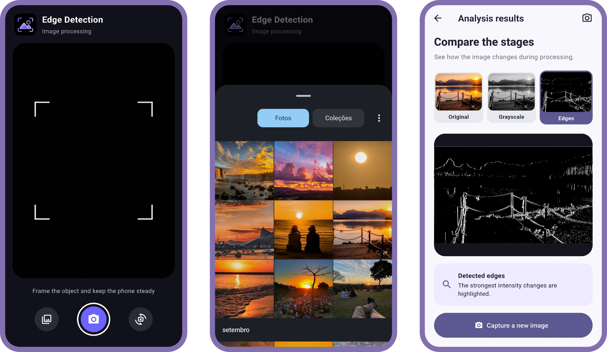

<p align="center">
  
</p>

<h1 align="center">Edge Detection</h1>

<p align="center">
  
  
  
</p>

<div align="center">
  
[](https://github.com/lianeheidemann/edge-detection-app/actions/workflows/release.yml)

</div>

<p align="center">A Flutter mobile application that captures images with the device camera and applies image-processing techniques.</p>

---

## Interface



---

## Overview

The application allows users to capture a photo or select one from the device gallery and automatically view:

- The original image
- A grayscale version
- A version processed with basic edge detection

---

## Technologies

- Flutter
- Dart

### Key packages

- [`camera`](https://pub.dev/packages/camera) — device camera access and capture
- [`image_picker`](https://pub.dev/packages/image_picker) — importing images from the gallery
- [`image`](https://pub.dev/packages/image) — grayscale conversion and edge-detection processing

---

## Features

- Capture images with the device camera
- Switch between the front and rear cameras
- Import images from the device gallery
- Convert images to grayscale automatically
- Apply a basic edge-detection algorithm
- Compare the original, grayscale, and edge-detected images side by side
- Navigate through a simple capture-and-results interface

---

## Project structure

```
lib/
├── main.dart              # App entry point and theme setup
└── pages/
    ├── camera_page.dart   # Camera preview, capture, and gallery import
    └── result_page.dart   # Original, grayscale, and edge-detection comparison
```

---

## Getting started

### Prerequisites

- [Flutter SDK](https://docs.flutter.dev/get-started/install) (Dart SDK `^3.11.5`, as required by `pubspec.yaml`)
- Android Studio / an Android SDK for building and running on Android
- A physical device or emulator with camera support

### Running the app

```bash
# Install dependencies
flutter pub get

# Run on a connected device or emulator
flutter run
```

### Building an Android APK

```bash
flutter build apk --debug
```

A GitHub Actions workflow (`.github/workflows/temporary-apk.yml`) also builds a debug APK automatically on every push to `main` and publishes it as a downloadable artifact.

---

<p align="center">Developed by <strong>Liane Heidemann</strong></p>
